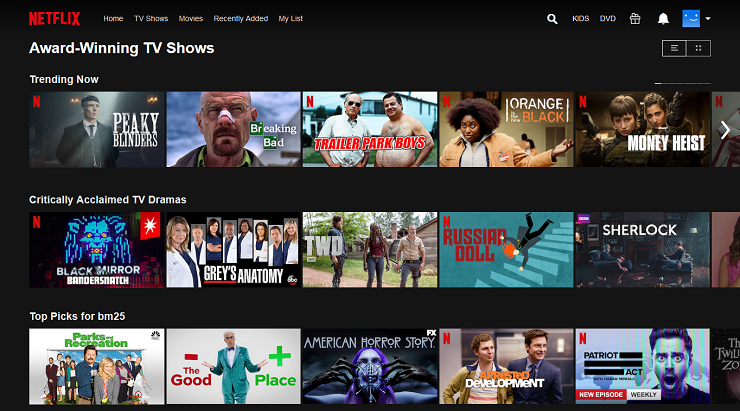

 
  

<h1 align="center"> Netflix Movies And TV Shows Clustering </h1>
<h3 align="center"> AlmaBetter Verfied Project - <a href="https://www.almabetter.com/"> AlmaBetter School </a> </h5>

 

### **Problem Statement-** 
This dataset consists of tv shows and movies available on Netflix as of 2019. The dataset is collected from Flixable which is a third-party Netflix search engine.

In 2018, they released an interesting report which shows that the number of TV shows on Netflix has nearly tripled since 2010. The streaming service’s number of movies has decreased by more than 2,000 titles since 2010, while its number of TV shows has nearly tripled. It will be interesting to explore what all other insights can be obtained from the same dataset.

Integrating this dataset with other external datasets such as IMDB ratings, rotten tomatoes can also provide many interesting findings.

In this project, you are required to do
*  Exploratory Data Analysis

*  Understanding what type content is available in different countries

*  Is Netflix has increasingly focusing on TV rather than movies in recent years.

*  Clustering similar content by matching text-based features

<h2> :floppy_disk: Project Files Description</h2>

This Project includes 2 colab notebook, 1 for EDA and other for clustering: 

<h4>Executable Files:</h4>
<ul>
  <li><b>EDA-NETFLIX MOVIES AND TV SHOWS CLUSTERING.ipynb</b> - Includes all Exploratory Data Analysis functions required for classification operations.</li>
</ul>
<li><b>Clustering-NETFLIX MOVIES AND TV SHOWS CLUSTERING.ipynb</b> - Includes all functions required for Clustering operations.</li>
</ul>
<h4>Output:</h4>
<ul>
  <li><b>Google Colab</b> - All the outputs are visible in the provided colab notebook.
</ul>

<h4>Data Source:</h4>
<ul>
  <li><b>Dataset</b> - https://www.kaggle.com/shivamb/netflix-shows</li>
</ul>

<h2> :book: K-Means And Recommender System</h2>

We have used a K Means clustering with an optimal value of k=6 for clustering the Text Based Columns. The value of k was chosen from the elbow method of WCSS score and silhouette score. 

We were able to come up with the following clusters and name it accordingly. 

1. Cluster 0: Kids, Animation & Anime
2. Cluster 1: Musical International & Indian
3. Cluster 2: Drama, International, Indian
4. Cluster 3: Documentaries, Sports
5. Cluster 4: Drama, American, Adventure
6. Cluster 5: Comedy

<h2> :clipboard: Execution Instruction</h2>

The order of execution of the colab notebook is as follows:

<b>1) TEAM_REALITY_ANDRIOD_AUTHENTICITY_PREDICTION.ipynb</b>

First, click on the open in colab button present on the top center of the notebook.

<b>2) Kaggle Dataset</b>

Downlaod the dataset from kaggle through provided link.Then, connect to the runtime and execute the cell to mount the drive or upload the data file to the current runtime.

<b>3) Cell Path</b>

Finally, delete the path in the dataset loading cell and replace it with the path of your current data file. Run each cell to see the output below it.

<!-- CREDITS -->
<h2 id="credits"> :scroll: Credits</h2>

Yash Patil | Avid Learner | Data Scientist | Machine Learning Engineer | Deep Learning enthusiast

 <i> Contact me for Data Science Project Collaborations</i>

<h2> :books: References</h2>
<ul>
  <li>
Kaggle.com 'EDA & Recommend Netflix' [Online].

      
Available: https://www.kaggle.com/poolkit/eda-recommend-netflix

  </li>
  <li>
Medium.com 'Understanding K-means Clustering in Machine Learning' [Online].

      
Available: https://towardsdatascience.com/understanding-k-means-clustering-in-machine-learning-6a6e67336aa1

  </li>
  <li>
neo4j.com, 'Cosine Similarity'. [Online].

      
Available: https://neo4j.com/docs/graph-data-science/current/alpha-algorithms/cosine/#:~:text=Cosine%20similarity%20is%20the%20cosine,'%20lengths%20(or%20magnitudes).

  </li>
  <li>
Youtube.com, '4 Basic Types of Cluster Analysis used in Data Analytics'. [Online].

      
Available: https://www.youtube.com/watch?v=Se28XHI2_xE

  </li>
</ul>

# Netflix-Movies-and-TV-Shows-Clustering

### In this project, we performed:

###    **1) Exploratory Data Analysis**

###    **2) Understanding what type content is available in different countries**

###    **3) Is Netflix has increasingly focusing on TV rather than movies in recent years**.

###   **4) Clustering similar content by matching text-based features**

